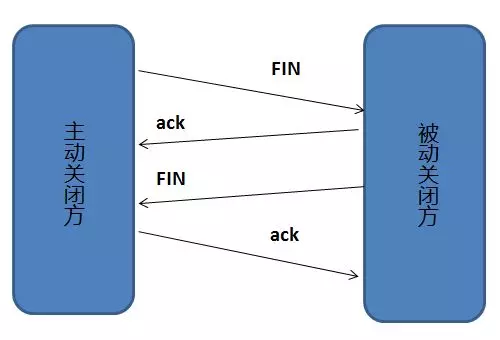
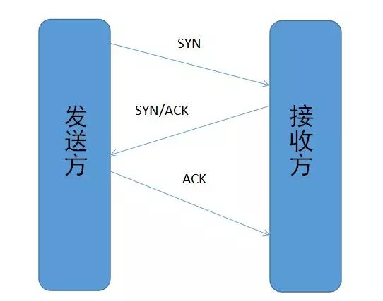
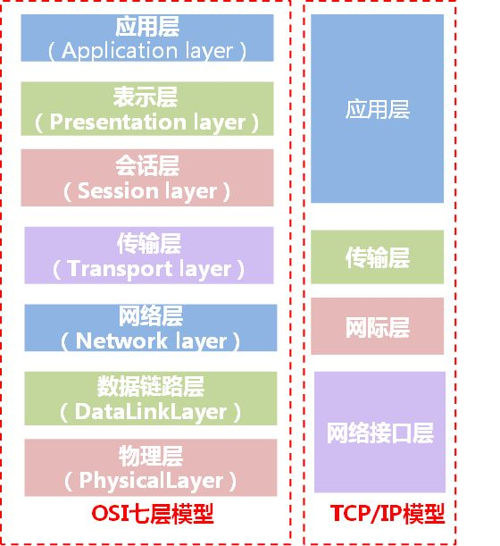

# 工作计划

### 预复习知识点：

#### 语言类：

##### 通用：

闭包和类的区别

>**定义：**
>
>闭包本质上是个函数，如果存在嵌套的函数，且子函数引用了父函数的变量，该子函数和引用的父函数的变量即会形成闭包。
>
>**python中闭包实现机制：**
>
>所有函数都存在一个`__closure__`属性如果该函数为闭包，返回一个元组对象，其中的call_content 属性即为闭包中的自由变量
>
>**闭包优点：**
>
>闭包包含了函数和其作用域外的局部变量
>
>闭包避免了使用全局变量
>
>**使用范围：**
>
>1. 装饰器
>
>2. python的迭代中没有作用域概念，可以使用闭包来保持迭代中迭代变量的值。

尾递归优化

> **递归缺点：**展开时需要大量中间缓存占用栈空间（因为要保存函数的入口环境）
>
> **尾递归：**只在函数的尾部返回自身调用，可以不保存入口环境得到正确值。
>
> **尾递归优化：**转化为循环
>
> 。。。。。感觉没啥用，应该是给函数式编程用的

高阶函数

> 1.接受函数作为参数的函数 E.G.: filter()
>
> 2.返回一个函数的函数 E.G.: 懒加载

面向对象和面向过程的区别

> **面向过程**
>
> 优点：
>
>  性能比面向对象高，比如单片机、嵌入式开发、Linux/Unix等一般采用面向过程开发，性能是最重要的因素。
>
> 缺点：
>
>  没有面向对象易维护、易复用、易扩展
>
> **面向对象**
>
> 优点：
>
>  易维护、易复用、易扩展，由于面向对象有封装、继承、多态性的特性，可以设计出低耦合的系统，使系统更加灵活、更加易于维护
>
> 缺点：
>
>  性能比面向过程低， 因为类调用时需要实例化，开销比较大，比较消耗资源

##### Python

lambda表达式

> **格式：**`lambda [arg1][,arg2, arg3.....] :expression `
>
> 表达式只能由一行 不能使用if for print
>
> **目的：**减少单行函数，使代码更简洁 
>
> 返回一个函数对象，这个对象没有名称，但可以将lambda表达式赋给一个变量来调用
>

生成器（Generator）

> 懒加载机制，节省内存空间
>
> 列表生成式：[使用x的表达式 for x in 可迭代对象]
>
> 生成器：(使用x的表达式 for x in 可迭代对象)
>
> 生成器存在next()方法，调用时计算下一个返回值，同时生成器也为可迭代对象，可通过迭代获取所有值
>
> yield关键字的作用：使用yield的函数被解释器视为生成器，遇到yield关键字时返回yield右值并记录位置，下次调用next方法时从yield的下一行开始执行。

@property

>表现为将被装饰的方法变为可直接访问和修改的属性。具体使用时可以用它来实现类似于私有属性的效果。

装饰器（Decarator）：

> 将被装饰的函数作为传入值，传给装饰器函数，进行包装之后返回新的函数。E.G. ：为一个函数添加传入值检查

偏函数

>与装饰器类似，同样是一种语法糖，可以固定函数中的某些参数的值，即设定一个默认值

static method 和 class method

> static method表示这个函数不需要用到类（cls）和实例（self）作为传入值与外部的函数效果相同
>
> class method 表示该函数只用到了类（cls）作为传入值，与实例无关，与C++中的静态方法相同

元类

> python 中类也是一个对象，元类就是类（对象）的模板

异常处理（try except finally ）

>except用来捕获所有的异常 Python中的所有错误都会抛出一个异常

Python是如何进行内存管理的？

>

Python的布尔判断

> 在Python中，None、任何数值类型中的0、空字符串 “”、空元组 ()、空列表 []、空字典{}都被当作False，自定义类型，如果实现了 　__ nonzero __ ()　或　__ len __ () 方法且方法返回 0 或False，则其实例也被当作False，其他对象均为True。

Python的三元运算

> bool and x or y  体现了Python中的短路语法 如果 bool表达式为假则短路x返回y 如果为真则短路y
>
> ​                             有坑->如果x为空串等False类对象，则会返回y
>
> x if bool else y 推荐方式

GIL的理解

>

##### Java

重载与重写

>

final关键字 

>

##### C++

虚函数实现机制

>

菱形继承出现的问题及解决方法

> 最终的子类中会存在两份祖类的代码，具有二义性，并且数据冗余
>
> 消除二义性：直接指定访问对象
>
> 消除数据冗余：使用虚函数

内存管理

>

多态的实现和理解

>

#### 网络类：

TCP UDP区别

>**UDP：**
>
>1. 不保证传输可靠性
>
>2. 以数据报文段形式通信（应用程序下发的报文直接添加首部之后直接移交IP层不打包或拆分）
>
>3. 吞吐量与数据生成速率和网络速率有关，没有拥塞控制算法。
>
>4. 可以一对一，也可以一对多，多对多。
>
>**TCP：**
>
>1. 面向连接，尽量保证可靠性
>
>2. 只能一对一，点对点
>
>3. 面向字节流，会进行分包或打包
>
>4. 速率会受到拥塞控制算法的影响
>
>

TCP三次握手四次挥手

>**三次握手：**
>
>
>
>
>
>**为什么要三次握手：**
>
>最低需要3次通信才能互相确认自己和对方之间的双向连接正常
>
>第一次握手 接收方确认对方发送正常 
>
>​                   发送方通知接收方自己的 SEQ=x
>
>第二次握手 发送方确认自己接收发送正常，对方接收发送正常 接收方只能确认自己接受正常，对方发送正常
>
>​                   接收方通知发送方自己的 SEQ = y 并且回复 ACK = x+1
>
>第三次握手 双方确认双方接收发送都正常
>
>​                   发送方回复接收方ACK = y+1
>
>四次挥手：
>
>
>
>**为什么要四次挥手**
>
>任何一方都只能主动关闭自己的发送连接，但不能关闭接收对方发送的连接，防止数据丢失。

TCP 包为什么需要 SEQ

> seq编码是ack机制的组成部分
>
> seq用来标记数据包，并且用来和ACK回执搭配确认数据包是否正确抵达
>
> 如果到达设定时间没有收到对应的ack就重发包，
>
> 如果接收到的seq和之前的顺序不符，则丢弃包，重发上一份ack

TCP为什么可靠

> 1. 校验和机制（每次接收到包之后都会进行计算，不正确就丢弃包）
>
> 2. 定时器（分组丢失重传）
>
> 3. ack机制（sqe编号）
>
> 4. 滑动窗口和流水线机制
>
> 5. 连接的建立和断开机制

TCP拥塞控制

HTTP长连接

HTTP基础知识（GET POST区别 header中各个字段的作用 ）

HTTPS（SSL）相关理解

在浏览器中输入URL到显示出页面的过程

cookie和session的实现

对RESTful的理解

> 使用URI

OSI七层模型

>
>
> 
>
> 每层对上层透明

#### 系统类：

同步 异步

> **同步**就是一个任务的完成需要依赖另一个任务，只有被依赖的任务完成了，依赖的任务才会完成。
>
> 是一种可靠的任务序列（打电话：只有对方接起来才能成功）
>
> **异步**就是依赖的任务不需要等待被依赖的任务完成，只是通知被依赖的任务要做什么，依赖的任务完成与否只取决于自身的执行。
>
> 是一种不可靠的任务序列（发短信：只要发送出去就成功）

阻塞 非阻塞

> 阻塞和非阻塞关注的是 **程序在等待调用结果（消息，返回值）时的状态.**
>
> 阻塞：结果返回之前，当前程序将会被挂起，直到结果返回
>
> 非阻塞：结果不能立刻返回时，不挂起程序，而是返回一个错误。
>
> 非阻塞会**提高CPU的利用率**，但是会增加**系统进程切换成本**，切换成本高于等待成本时使用异步是低效的

内核态 用户态， 内核空间 用户空间

> 操心系统将虚拟空间划分为两部分，一部分为内核空间，供内核使用，一部分为用户空间，供各个进程随意使用。
>
> cpu一般有多个权限层级，Intel X86 计算机有0~3共4个权限等级，Linux操作系统中主要采用了最高最低两个特权级，分别对应的就是内核态和用户态。
>
> 当一个任务执行用户自己的代码时，CPU处于3级状态，称其为用户态
>
> 当一个任务执行系统调用，**转为执行内核代码时**，CPU处于0级状态，称此时的任务处于内核态

文件描述符 fd

> Linux/Unix系统概念
>
> 在形式上是一个非负整数。实际上，它是一个索引值，指向内核为每一个进程所维护的该进程打开文件的记录表。

多路复用的优点，为什么不用多线（进）程

> 多路复用是指多路IO复用同一线程，应用程序需要进行IO操作时，就将一个或多个文件描述符交给select等程序，并阻塞于select而不是阻塞于IO，这样保证应用程序可以同时监听多个IO
>
> **多路复用的优势**
>
> 1. 当存在处理过程相对IO来讲可以忽略不计时（Nginx做代理，转发逻辑很简单，更多的时间和资源都消耗在了IO上），使用多路复用**可以在更少的CPU/内存占用的情况下达到更高的并发数**。
> 2. 当存在大量闲置的IO时适合使用多路复用，IO socket的数量不会带来进（线）程数量的增加，也就没有切换损失
> 3. 性能上限比较高，因为不用切换内核态和用户态，切换所占的时钟周期更少
> 4. 如果是单进（线）程+多路复用方案，可以减少并发编程中的各种冲突和一致性问题。简化代码。
> 5. 节省文件描述符资源
>
> **为什么直接使用多线（进）程**
>
> 1. 使用多路复用省资源：减少CPU进程切换，减少内存使用【新建进（线）程需要创新的栈】，性能上限高
> 2. 写起来简单：减少同步编程中的冲突和一致性问题
> 3. 非极限情况下线程池并不显著慢于多路复用，但是同等条件下多路复用占用资源更少
> 4. 如果程序需要监听大量IO，则可能

select poll epoll 区别

> **select**
>
> 优点
>
> 1. 跨平台支持
>
> 缺点
>
> 1. 单个进程能够监视的文件描述符受限
> 2. 需要维护一个用来存放大量fd的结构体，每次调用都要把在用户空间和内核空间之间传递
> 3. 对socket进行扫描时是线性扫描，如果存在很多不活跃fd效率就会很低下
> 4. 返回时会返回整个数组，还需要遍历来获取数据
> 5. 会修改传入的参数数组
>
> **poll**
>
> 和select区别于
> 1. 描述符的保存方式更换为链表(去掉了select 的 32位系统 仅能存储1024个fd的限制)
> 2. 不再修改传入的参数数组
>
> **epoll**
>
> 通过注册事件表的方式管理fd，使用mmap方式减少内核空间用户空间之间的复制开销
>
> 优点
>
> 1. 没有描述符限制
> 2. 不再采用轮询方式，而是采用callback的方式，fd增多不会显著影响性能。
> 3. fd和callback方式在注册时就放到mmap中，不会每次调用都复制
> 4. 多了edge trigger（边缘触发）
> 
> 缺点 
> 1. 如果所有的socket都很活跃，性能会下降。
> 2. 不是所有平台都支持epoll
> 
> Level trigger：epoll_wait通知后没有处理，下次还会通知此事件
> Edge trigger：epoll_wait通知后没有处理，下次不再通知此事件

死锁原理和避免死锁

>

Linux文件系统

>

进程管理

>

线程相关

>**线程**
>
>本质就是堆栈，当一段程序在执行，能代表它的是他的过去和现在。
>
>"过去"在堆栈中，"现在"则是CPU的所有寄存器，如果我们要挂起一个线程，我们把寄存器也保存到堆栈中，我们就具有它的所有状态，可以随时恢复它。这是线程。

同步异步

>

进程间通信

>

线程的通信

>**同进程：**
>
>**异进程：**

中断原理

>

理解多线程和多进程的区别和优缺点

>进程是操作系统分配的最小单位，线程是CPU调度的最小单位
>
>**多线程**
>
>优点
>
>1. 创建和切换开销小。（不需要分配新的地址空间，不需要维护新的堆栈段）
>2. 同一线程下的进程相互数据共享，通信方便
>3. 可以设计出 更清晰的代码，可以将复杂任务细分到多个线程
>
>缺点
>
>1. 多个线程共享内存可能出现同步和一致性
>2. 线程过多可能出现一个线程出错影响其他所有线程
>3. 线程能提高的总性能有限
>4. 程序设计可能出错（同步，一致性）
>
>**多进程**
>
>优点
>
>1. 具有内核保证的数据隔离和错误隔离
>2. 可伸缩性更好，进程之间相互隔离
>
>缺点
>
>1. 数据隔离使得进程之间通信不方便
>2. 进程之间切换开销要比线程切换开销大

#### 分布式类：

Celery

> 

#### 数据库类：

SQL和NoSQL的区别

>

MySQL两种数据引擎区别

> **MyISAM**
>
> 1. 不支持事务
> 2. 不支持外键
> 3. 只读性能高
> 4. 不支持行级锁（对整张表加锁）
> 5. 非聚簇索引，索引数据分开存储，索引保存的是数据文件的指针，主键和辅助索引分离
> 6. 支持全文搜索
> 7. 保存表的具体行数,不带where时，直接返回保存的行数
> 8. DELETE 表时，先DROP表，然后重建表
>
> **InnoDB**
>
> 1. 支持事务，事务异常提交会回滚
> 2. 支持外键
> 3. 支持行级锁
> 4. 采用聚簇索引，通过主键查询效率比较高
> 5. 不保存表的具体行数，count(*) 的时候要全表扫描
> 6. DELETE时，不重建表，而是逐行删除
> 7. 不支持FULLTEXT类型的索引
> 8. 跨平台可直接拷贝使用
> 9. 支持崩溃自动修复
>
> 

索引理解与实现

> 索引的优点：1. 天生排序。2. 快速查找。
> 索引的缺点：1. 占用空间。2. 降低更新表的速度。
>
> 分六种索引：
>
> 普通索引，唯一索引，主键索引，复合索引，外键索引，全文索引
>
>

数据库事务的理解

>

分页的实现

>

ACID的理解

>

#### 算法与数据结构类：

##### 算法

时间复杂度

空间复杂度

排序（快速排序 冒泡排序 选择排序 插入排序 堆排序）

查找（二叉排序树 平衡二叉树 B+树 红黑树）

深度优先遍历 广度优先遍历

缓存置换算法

LRU

Hash算法

##### 数据结构

栈和队列的实现和理解

线性表的实现和理解

二叉树

#### 安全类：

XSS的理解

csrf理解

sql注入

#### 其他类：

Nginx反向代理

Docker相关知识（分层镜像，隔离，虚拟化， 容器）

文字编码

### 预学习知识点：

##### Java

垃圾回收

类加载

泛型

AOP

反射

单例模式

##### 数据库

cache的理解

